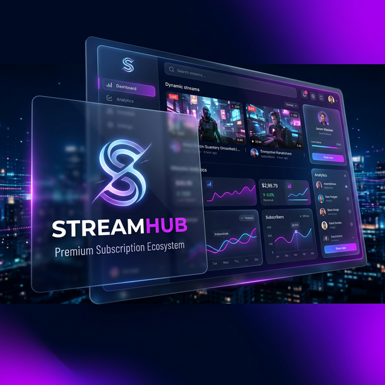
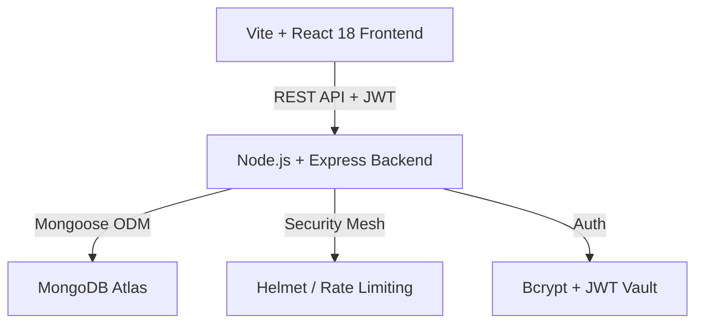

# 🎯 STREAMHUB: Premium Cinematic Subscription Ecosystem



[](https://opensource.org/licenses/MIT)
[](https://nodejs.org/)
[](https://reactjs.org/)
[](https://www.mongodb.com/)
[](https://vitejs.dev/)

**STREAMHUB** is a high-performance, cinematic full-stack platform engineered for managing digital memberships and content distribution. It features a state-of-the-art visual design system inspired by leading streaming platforms like Netflix and Disney+, providing an immersive user experience paired with a robust administrative backbone.

---

## ✨ Visionary Features

### 🎬 For Users (Consumers)
- **Cinematic Authentication**: High-end animated login/register flows with real-time field validation.
- **Glassmorphism Discovery**: A visual-first content library featuring Ken Burns effects and interactive hover transformations.
- **Theater Mode**: An immersive 4K-ready video player with cinematic controls and playback speed management.
- **Smart Dashboard**: A premium SaaS-style user control center for real-time subscription status and account orchestration.
- **Responsive Fluidity**: Perfectly optimized motion design across desktop, tablet, and mobile screens.

### 🛡️ For Administrators (Command Center)
- **Plan Orchestration**: Create, update, and manage multi-tiered subscription levels (Basic, Premium, Pro) in real-time.
- **User Insights**: Comprehensive dashboard for monitoring user signups, active subscriptions, and system-wide analytics.
- **Revenue Control**: Integrated coupon management and price tiering logic.
- **Security Mesh**: Role-Based Access Control (RBAC) ensuring tiered content locking and administrative integrity.

---

## 🛠️ Technical Excellence

### 🏗️ Architecture
The system follows a decoupled **MERN** architecture (MongoDB, Express, React, Node.js) with a focus on performance and security.



### 🧰 Tech Stack
- **Frontend**: React 18, Vite, Tailwind CSS, Framer Motion, React Icons, date-fns.
- **Backend**: Node.js, Express.js, MongoDB Atlas, Mongoose.
- **Security**: JWT Stateless Auth, Bcrypt Password Hashing, Helmet.js Security Headers, Express-Rate-Limit.
- **Styling**: Vanilla CSS + Tailwind Core for a high-end "Glassmorphism" aesthetic.

---

## 🚀 Rapid Deployment

### 1️⃣ Prerequisites
- Node.js (v18+)
- MongoDB (Local or Atlas)
- NPM or Yarn

### 2️⃣ Clone & Install
```bash
git clone https://github.com/your-username/streamhub-platform.git
cd streamhub-platform

# Install Backend Dependencies
cd server && npm install

# Install Frontend Dependencies
cd ../client && npm install
```

### 3️⃣ Configuration
Create a `.env` file in the `server/` directory:
```env
PORT=5000
MONGODB_URI=your_mongodb_connection_string
JWT_SECRET=your_jwt_vault_secret
JWT_EXPIRE=7d
CLIENT_URL=http://localhost:5173
```

### 4️⃣ Execution
**Backend:**
```bash
cd server && npm run dev
```
**Frontend:**
```bash
cd client && npm run dev
```

---

## 🔐 Default Access (Seed Data)
To populate the system with professional sample data, run:
```bash
cd server && node utils/seedData.js
```
| Role | Email | Password |
|------|-------|----------|
| **Admin** | `admin@example.com` | `admin123` |
| **User** | `user@example.com` | `user123` |

---

## 📊 Subscription Archetypes

| Tier | Price | Features |
| :--- | :--- | :--- |
| **Basic** | $9.99 | Standard Library Access, 720p Streaming |
| **Premium** | $19.99 | Priority Synchronization, 1080p HD |
| **Pro** | $29.99 | 4K Content, Unlimited Devices, Early Premieres |

---

## 📝 Compliance & Performance
- **Security**: Hardened against XSS, NoSQL Injection, and Brute Force attacks.
- **SEO**: Semantic HTML5 with optimized meta-structures for search engine visibility.
- **Accessibility**: ARIA compliant components with focus on high-contrast readability.

---

**Elevating the standard of digital memberships. Powered by STREAMHUB.**
